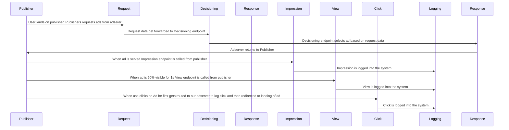

# Request lifecycle

# Request error paths
| Step | Failure scenario | Detection | API response | Retry? | Logged fields |
| ---- | ---------------- | --------- | ------------ | ------ | ------------- |
| /request | Missing required field | Schema validation fails | Status code: 400,error_code, error_msg  | No | request_id, error_code, request_body |
| /impression | Impression call without valid request_id |

Endpoint | Method | Why this method | 2xx | 4xx cases | 5xx cases