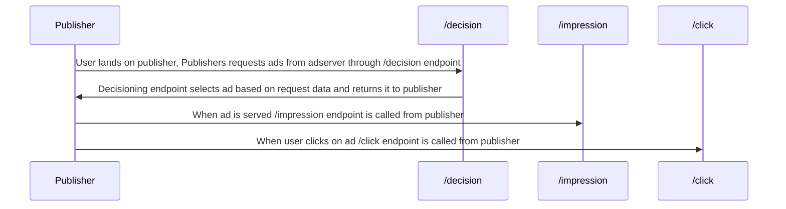

# Request lifecycle

# Idempotency
Idempotency is the concept that the same operation repeated doesnt change the state of object being operated on.

In an Adserver idempotency is important when logging ad statistics such as impressions, view and clicks so that we don't accidently double count on retries due to networking issues.

We can achieve this simply by generating an event_id on the client side and sending it with the request or any subsequent retries. The server stores event_ids and if the same event_id is seen twice it doesn't get processed the seconds time. event_ids can expire after a 24h window.

We will probably use v4 uuid for our event_ids ([this is what stripe uses](https://docs.stripe.com/api/idempotent_requests))

# Service-level indicators
Quantitative raw measurmets of the systems performance, like latency, throughput, response times, uptime...

# Service-level objectives
Target values or ranges for SLIs during a specific period.

# Invariants
1. **One decision per `request_id`.** Each `request_id` must produce at most one `/decision` response so downstream counts and billing match the originating request, avoiding duplicate decisioning or attribution confusion.
2. **Persisted request metadata.** The server stores the decision payload keyed by `request_id` long enough (e.g., 24h) to validate later `/impression` and `/click` calls, which ensures traceability without keeping data forever.
3. **Impressions reference a recorded decision.** Every `/impression` must carry a `request_id` that was already seen on `/decision` (with metadata stored for at least 24h), so impressions can’t be created for unknown or replayed decisions.
4. **Clicks reference a recorded decision.** Every `/click` must carry the same validated `request_id`, keeping revenue attribution tied to the original impression/decision pair and preventing orphan click records.
5. **Event-to-request binding is one-to-one.** A given impression or click record never switches to another `request_id` partway through processing; each event keeps its original request identifier to keep reporting consistent.
6. **Decision latency bound.** Every `/decision` call must return a response in ≤300 ms under healthy conditions so downstream renderers have predictable time to show ads.
7. **Clicks never outnumber impressions for a request.** For any `request_id` the system records at least as many impressions as clicks, guarding against inflated click counts or badly ordered instrumentation.
8. **Malformed payloads are rejected before side effects.** Once the parser detects invalid JSON, the system sends the 400 error response and short-circuits before touching storage, preserving integrity.
9. **Missing required fields are blocked before processing.** Schema validation runs before business logic so incomplete requests are rejected with 400/`error_code`/`error_msg` and no downstream state changes occur.
10. **Type mismatches never reach business logic.** Type-checking happens as part of the same validation pass, ensuring the core logic only sees typed, sanely structured data.
11. **Impression and click events are idempotent.** Each `/impression` or `/click` call must include a client-generated `event_id`; the server only counts an event the first time it sees that identifier so retries don’t double count stats.
12. **Structured telemetry on every request.** Every `/decision`, `/impression`, or `/click` logs (or emits a metric with) `request_id`, event outcome, and `error_code`/message when present, keeping observability towers coherent.
13. **Authenticated publishers only.** Only verified publisher credentials/keys may call the endpoints, so downstream systems can trust the provenance of impressions/clicks and the ad inventory isn’t hijacked.

# Theory test review

## Question 3: Decision framework for temporary workarounds vs delayed releases
**Question**
> You discover a service dependency is frequently failing in production, but the failure rate hasn’t triggered any alerts yet. The dependency team is slow to respond, and your feature release depends on it. Do you implement a temporary workaround in your service, delay the release, or something else? Explain the trade-offs and your decision.

The basic idea here is that you don't want to delay releases but you also don't want to release something that you know will be buggy. You can create a temporary workaround and put it behind a feature flag, align with the dependency team to remove feature flag after their dependency is stable. You should also harden your client so it doesn't fail even with flaky dependency, do this with circuit braker and exponential retries, these should stay in after the feature flags.

### Further questions

Not entirely sure how to design more robust clients, needs further research

## Question 9: Establish a multi-team deployment playbook

**Question**
> A new feature requires multiple teams to coordinate deployments. One team wants to merge early, while another is still stabilizing their changes. How do you manage the coordination, and what trade-offs influence your timeline?

You don't want to block the team that already finished so you release the feature under a flag to let the blocking team catchup and stabilize. You also write down API contracts for easier integration when both teams are ready.

Release under feature flag also lets you find more bugs since it's released to production code. This does increase testing overhead since you now have to test at least 2 new paths (or more if feature depend on each other). You also have the overhead of cleaning up the feature flag in the future when both features are merged and everything is integrated and working nicely. Create a tracking ticket for the cleanup.

## Question 14: Eventual consistency risk/mitigation

**Question**
> When do you favor an eventually consistent data model over strong consistency, and what risks do you explicitly accept or mitigate with that choice?

You favor eventual consisteny when you can accept that your users will be reading stale data and you want to have low latency on an input. The typical examples are social media feeds and logging system. You want to process the inbound traffic ASAP but if the user doesn't see the exact right "like" count on a post it won't be the end of the world.

The risks you are accepting are write conflicts, reading stale data, ordering issues and lost updates.

Mitigation strategies. Sync the nodes on down time, monitor "how stale" the data is, read repair.

## Question 16: Automation vs. manual QA trade-offs

**Question**
> What’s your approach to deciding whether to add a new automated test versus rely on manual QA, and what trade-offs do you weigh around coverage, speed, and maintenance?

**Instruction**
> Create guidelines comparing automation vs. manual testing trade-offs around coverage, speed, and maintenance.

Automatic tests have a hig upfront const but save time in CI and deployment. They should be used for regression tests, integration tests, testing stable behaviour, data driven tests. There is a high maintenance cost, you have to refactor the tests if the business logic changes, you have to fix flaky tests so they don't give you false confidence.

Manual testing has no upfront cost but it slows down the release. Its best used for UI/UX feel, for MVP unstable features and for doing broad edge case testing. You have to keep in mind the human labour cost and exhaustion.